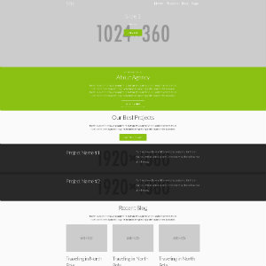

# Waldläufer Theme for Grav

Waldläufer is a theme for the [ForestryCodes website](https://forestry.codes).

# Features

* Fully responsive
* Automatic navigation menu included
* Modular homepage with slider, about section, recent blog posts and project showcase.
* Footer with customizable quicklinks via theme options
* Blog page with support for Archives, SimpleSearch and Feed plugins
* SCSS files included for deeper customization options

# Installation

Installing the theme via GPM (Grav Package Manager) is not supported.

## Manual Installation

To install this theme, just download the zip version of this repository and unzip it under `/your/site/grav/user/themes`. Then, rename the folder to `waldlaufer`. You can find these files on [GitHub](https://github.com/ForestryCodes/grav-waldlaufer).

You should now have all the theme files under

    /your/site/grav/user/themes/waldlaufer

>> NOTE: This theme is a modular component for Grav which requires the [Grav](http://github.com/getgrav/grav), [Error](https://github.com/getgrav/grav-theme-error) and [Problems](https://github.com/getgrav/grav-plugin-problems) plugins.
>> 
>> The plugins [SimpleSearch](https://github.com/getgrav/grav-plugin-simplesearch), [Archives](https://github.com/getgrav/grav-plugin-archives) and [Feed](https://github.com/getgrav/grav-plugin-feed) should also be installed for the blog sidebar.

# Updating

## Manual Update

Manually updating the theme is pretty simple. Here is what you will need to do to get this done:

* Delete the `your/site/user/themes/waldlaufer` directory.
* Download the new version of the theme from [GitHub](https://github.com/ForestryCodes/grav-waldlaufer).
* Unzip the zip file in `your/site/user/themes` and rename the resulting folder to `waldlaufer`.
* Clear the Grav cache. The simplest way to do this is by going to the root Grav directory in terminal and typing `bin/grav clear-cache`.

> Note: Any changes you have made to any of the files listed under this directory will also be removed and replaced by the new set. Any files located elsewhere (for example a YAML settings file placed in `user/config/themes`) will remain intact.

# Setup

If you want to set Waldläufer as the default theme, you can do so by following these steps:

* Navigate to `/your/site/grav/user/config`.
* Open the **system.yaml** file.
* Change the `theme:` setting to `theme: waldlaufer`.
* Save your changes.
* Clear the Grav cache. The simplest way to do this is by going to the root Grav directory in Terminal and typing `bin/grav clear-cache`.

Once this is done, you should be able to see the new theme on the frontend. Keep in mind any customizations made to the previous theme will not be reflected as all of the theme and templating information is now being pulled from the **waldlaufer** folder.